  
   
  <b>AWS 운영 자동화와 IaC, GitOps에 집중하는 개발자</b>

---

## About Me
- AWS 기반 운영 자동화, IaC, GitOps, Backend를 중심으로 경험을 쌓고 있습니다.
- 대표 프로젝트는 **ACS-DnDn**이며, `DnDn-App` / `DnDn-Infra` / `DnDn-HR`를 넘나들며 개발과 배포를 함께 다뤘습니다.
- `DnDn-App`에서는 **CloudTrail / AWS Config / AWS Health 기반 worker 기능**, **S3 산출물 업로드**, **AssumeRole 기반 수집 흐름**, **데이터 정합성 개선** 작업을 진행했습니다.
- `DnDn-Infra`에서는 **Terraform**, **External Secrets**, **Argo CD GitOps**, **CI workflow** 작업을 진행했습니다.
- 다른 ACS 계열 프로젝트로는 **ACS-RED**에서 AWS EC2 기반 **3-Tier / HA 구조**를 실습했습니다.

---

## Representative Project

### ☁️ ACS-DnDn
> AWS 운영 이벤트를 수집하고, 운영자가 바로 판단할 수 있는 대시보드 · 문서 · 보고서 · Terraform Draft로 연결하는 클라우드 운영 플랫폼

- **Organization**  
  [ACS-DnDn](https://github.com/acs-dndn)

- **Repositories**
  - [DnDn-App](https://github.com/ACS-DnDn/DnDn-App)  
    React/TypeScript Web, FastAPI API, AWS 수집 Worker, Report Service
  - [DnDn-Infra](https://github.com/ACS-DnDn/DnDn-Infra)  
    Terraform, CloudFormation, Lambda, Argo CD 기반 GitOps 인프라
  - [DnDn-HR](https://github.com/ACS-DnDn/DnDn-HR)  
    사용자 · 부서 · 권한 관리용 HR 포털

- **What I Worked On**
  - CloudTrail 주간 수집 및 canonical JSON 정규화
  - 리소스별 AWS Config 상태 보강 및 오류 이유 개선
  - raw / normalized 산출물 S3 업로드 기능 추가
  - AssumeRole 기반 고객 계정 수집 지원
  - AWS Health 이벤트 소스 확장
  - External Secrets 기반 secret 관리 전환
  - Argo CD 배포 흐름 및 Terraform workflow 개선

---

## Other ACS Projects

### 🏇 ACS-RED
> AWS EC2 환경에서 3-Tier(Web-App-DB) 구조와 고가용성(HA)을 검증한 실습 프로젝트

- **Organization**  
  [ACS-RED](https://github.com/ACS-RED)

- **Repository**
  - [source-code](https://github.com/ACS-RED/source-code)

- **Project Highlights**
  - Spring Boot 기반 실시간 레이스 / 베팅 웹 서비스
  - AWS EC2, Nginx, RDS(MySQL) 기반 3-Tier 구성
  - Active-Active 환경에서 DB 기반 Leader Election으로 스케줄러 중복 실행 문제 해결
  - PRD / DEV VPC 분리, VPC Peering, Bastion, Auto Scaling 구조를 포함한 인프라 실습

---

## Tech Stack

### Cloud / DevOps

  
  
  
  
  
  

### Backend / App

  
  
  
  
  
  

### Data / Platform

  
  
  
  
  

---

## Contact

  
  
  

---

## GitHub Stats

  

---

## Representative Repositories

  
  
  

